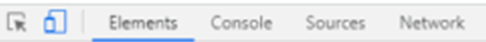
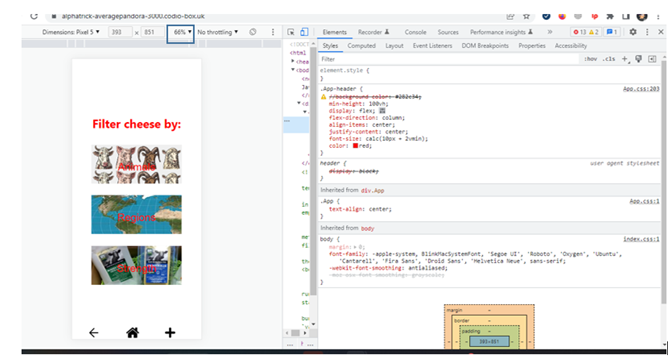

### Set Up
Step 1: open two terminals
Step 2: in the first Terminals Input the following Commands 

$ cd cheese-index/
$ npm start

Step 3: in the second terminal input the following commands:

$ . venv/bin/activate
$ export FLASK_APP=API
$ flask run --host=0.0.0.0

Step 4: one BOX URl in new tab 
Step 5: Open inspect elements on the URL
Step 6: click the icon shown in blue 

Step 7: Change the  Persentage initcated in the blue box till it looks like the screen below 

Step 8: use the software